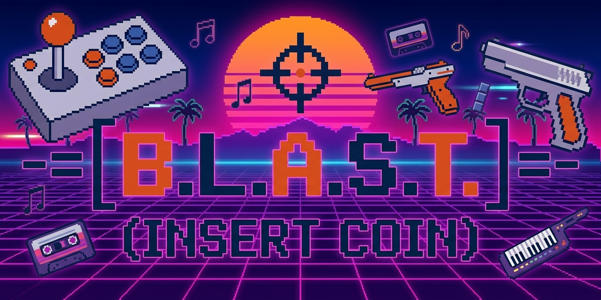

# B.L.A.S.T. - Button Logic & Arcade Simulation Terminal

<p align="center">
  
</p>

A comprehensive open-source arcade controller platform featuring customizable button mapping, LED control, and a modern configuration tool.

## Overview

B.L.A.S.T. is a complete arcade controller solution designed for retro gaming and arcade simulation enthusiasts. It combines a RP2040/RP2350-based firmware with an intuitive companion application to deliver a fully programmable arcade input device with per-button LED control.

## Key Features

### Hardware
- **RP2040/RP2350 Microcontroller** - Powerful ARM-based processor for responsive input handling
- **Customizable Button Mapping** - Up to 12+ configurable buttons with flexible key remapping
- **RGB LED Support** - Per-button LED control with multiple lighting modes:
  - Off, On (static), Breathing, Blinking
  - Individual brightness control for each channel
- **MCP23X17 I/O Expander** - Extended GPIO for button input and LED output
- **OLED Display** - Real-time profile and status display (128x64)
- **USB & Wireless Support** - HID-compliant keyboard interface

### Software
- **Configuration Tool** - Cross-platform Rust GUI application for easy setup
- **Profile Management** - Save and load multiple button configurations
- **Real-time Serial Communication** - Instant updates between device and computer
- **Themeable UI** - Light/Dark/System theme support

## Project Structure

```
blast/
├── firmware/          # Arduino/C++ firmware for RP2040/RP2350
│   ├── firmware.ino   # Main firmware entry point
│   ├── menu.cpp       # OLED display and menu system
│   ├── debounce_mcp.cpp # Button debouncing logic
│   ├── storage.cpp    # Profile storage management
│   └── serializer.cpp # Serial communication protocol
│
├── app/               # Rust configuration tool
│   ├── src/
│   │   ├── main.rs    # Application entry point
│   │   ├── ui.rs      # egui-based user interface
│   │   ├── protocol.rs # Serial protocol implementation
│   │   └── types.rs   # Data structures
│   └── Cargo.toml
│
├── pcb/               # KiCAD PCB designs
│   └── blast/         # Main board schematic and layout
│
└── CHANGELOG.md       # Release notes and version history
```

## Getting Started

### Firmware Development

**Requirements:**
- Arduino IDE or PlatformIO
- [Arduino-Pico](https://github.com/earlephilhower/arduino-pico) board package by Earle F. Philhower, III — **version 6.1.1** is used
  (Boards Manager URL: `https://github.com/earlephilhower/arduino-pico/releases/download/global/package_rp2040_index.json`)
- Libraries (install via Library Manager or `arduino-cli lib install "<name>@<version>"`):

  | Library | Version used |
  |---------|--------------|
  | Adafruit MCP23017 Arduino Library | 2.3.2 |
  | Adafruit SSD1306 | 2.5.16 |
  | Adafruit GFX Library | 1.12.4 |
  | Adafruit BusIO | 1.17.4 |

  Wire, SPI, EEPROM, Keyboard, HID_Keyboard and tusb-hid are bundled with the Arduino-Pico core.

**Building:**
1. Open `firmware/firmware.ino` in Arduino IDE
2. Select RP2040/RP2350 board (Arduino-Pico core) from Tools menu
3. Compile and upload to device

### Configuration Tool

**Requirements:**
- Rust 1.70+
- Cargo

**Building & Running:**
```bash
cd app
cargo run --release
```

This launches the B.L.A.S.T. Configuration Tool GUI for managing profiles and button mappings.

## Hardware Components

- **Main MCU:** Raspberry Pi Pico (RP2040) or RP2350
- **I/O Expansion:** MCP23017 16-bit I/O expander
- **Display:** 128x64 OLED display (SSD1306)
- **Interface:** USB HID keyboard emulation
- **LED Driver:** TLC PWM drivers for LED control

## Serial Protocol

Communication between firmware and configuration tool uses a custom protocol over serial (115200 baud). The protocol supports:
- Button mapping configuration
- Profile save/load operations
- LED mode and brightness control
- Status and diagnostic information

See `app/src/protocol.rs` for detailed protocol specification.

Host software (e.g. games or output tools) can control the button LEDs through the simple line-based **BLAST protocol** on the same serial port. See [firmware/BLAST_PROTOCOL.md](firmware/BLAST_PROTOCOL.md).

## Configuration & Profiles

### Button Mapping
Each button can be mapped to a keyboard key or arcade function. Profiles allow saving multiple configurations for different games.

## Development

This project follows the **GitFlow** branching model. See [GITFLOW.md](GITFLOW.md) for detailed contribution guidelines.

## Changelog

For version history and release notes, see [CHANGELOG.md](CHANGELOG.md).

## License

This project is licensed under the MIT License - see the [LICENSE](LICENSE) file for details.

## Contributing

Contributions are welcome! Please follow the development workflow outlined in [GITFLOW.md](GITFLOW.md).

---

**Enjoy building and customizing your arcade controller! Insert coin to continue...** 🎮
