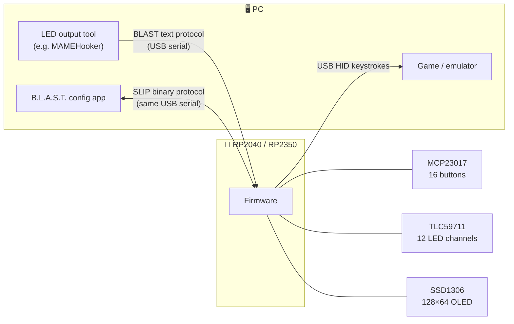

<div align="center">


### Button Logic & Arcade Simulation Terminal

**An open-source arcade control panel: 16 buttons, 11 dimmable LEDs, an OLED menu, and a desktop app to configure all of it.**

[](https://github.com/tbreckle/blast/actions/workflows/ci.yml)
[](https://github.com/tbreckle/blast/releases)
[](LICENSE)


[**Download**](https://github.com/tbreckle/blast/releases) ·
[Features](#-features) ·
[Quick start](#-quick-start) ·
[BLAST protocol](#-light-it-up-from-your-games) ·
[Building](#-building-from-source) ·
[Contributing](#-contributing)

</div>

---

## 🕹️ What is this?

B.L.A.S.T. is the button box that sits next to your lightgun or arcade cabinet. It presents itself to the PC as a plain **USB keyboard**, so every game and emulator understands it without drivers. Each game gets its own **profile** of key bindings, which you pick on the built-in **OLED** or let your frontend switch automatically. The **button LEDs** can be driven live by the game (blink the coin button, breathe the start button, flash on a hit) over a simple text protocol.

It's a full stack in one repo:

| | Component | Stack |
|---|---|---|
| 🧠 | [**Firmware**](firmware/) | C++ / Arduino on a Raspberry Pi Pico (RP2040 / RP2350) |
| 🖥️ | [**Config app**](app/) | Rust + [Slint](https://slint.dev), native on Linux, Windows and macOS |
| 🔌 | [**PCB**](pcb/) | KiCad schematic, layout and production files |

## ✨ Features

<table>
<tr>
<td width="50%" valign="top">

#### 🎮 Controller
- **16 inputs**: Start, Coin, Action A and Action B for two players, Pause / Save / Load, and a 5-way navigation pad
- **Plug and play**: USB HID keyboard, no drivers needed
- **Key combos**: letters, digits, Space, Enter, F1–F24, with Ctrl / Alt / Shift
- **Interrupt-driven debouncing** with a polling fallback

</td>
<td width="50%" valign="top">

#### 💡 Lighting
- **11 LED buttons** on a 12-channel TLC59711 PWM driver with gamma correction
- **Modes**: off, on, blink, breathe and flash sequences
- **Game-driven**: games and tools set the LEDs live over the [BLAST protocol](firmware/BLAST_PROTOCOL.md)
- **RGB status LED** that shows boot, config and run state

</td>
</tr>
<tr>
<td width="50%" valign="top">

#### 📟 On-device
- **128×64 OLED** menu to browse and pick profiles
- **Up to 50 profiles** stored in flash
- **Automatic profile switching** by game name, for example from MAMEHooker
- **Service menu** for the service and test buttons

</td>
<td width="50%" valign="top">

#### 🖥️ Config app
- **Create, edit and delete profiles** and press a key to bind it
- **Sync status** that shows what's changed and what's saved on the device
- **Version check**: warns when app and firmware don't match
- **Light / Dark / System** themes

</td>
</tr>
</table>

## 🚀 Quick start

1. **Grab the latest release** from the [Releases page](https://github.com/tbreckle/blast/releases):

   | File | What it is |
   |---|---|
   | `blast-firmware-X.Y.Z.uf2` | Firmware for the controller |
   | `blast-app-X.Y.Z-linux-x86_64.tar.gz` | Config app for Linux |
   | `blast-app-X.Y.Z-windows-x86_64.zip` | Config app for Windows |
   | `blast-app-X.Y.Z-macos-universal.tar.gz` | Config app for macOS (Apple Silicon + Intel) |

2. **Flash the firmware**: hold **BOOTSEL** while plugging in the Pico and drop the `.uf2` onto the `RPI-RP2` drive that shows up.
3. **Run the app**, pick the **B.L.A.S.T.** port (it's preselected), and create your first profile.
4. **Play.** Choose the profile on the OLED, or let your frontend switch to it.

> [!TIP]
> Use the app and firmware from the **same release**. The app shows a warning in the status bar when they differ. Builds labeled `0.0.0+<commit>` are unofficial development builds.

## 🌈 Light it up from your games

Out of the box the serial port speaks the **BLAST protocol**: one line of plain ASCII per command, with no handshake and no replies. Anything that can write to a serial port can drive the LEDs.

```bash
stty -F /dev/ttyACM0 115200 raw -echo
printf 'B1\n'          > /dev/ttyACM0   # host started: all LEDs off
printf 'BLxtcrisis\n'  > /dev/ttyACM0   # load the profile for "tcrisis"
printf 'B4x0x2x200\n'  > /dev/ttyACM0   # both coin buttons blink fast
printf 'B3x1x4x1500\n' > /dev/ttyACM0   # P1 start breathes with a 3 s cycle
printf 'B5x2x3x5\n'    > /dev/ttyACM0   # P2 action A flashes 5 times
```

The full spec is in [`firmware/BLAST_PROTOCOL.md`](firmware/BLAST_PROTOCOL.md).

## 🧩 How it fits together



One USB cable carries both the keyboard and the serial port. The serial port runs one of two protocols at a time: the **BLAST** text protocol for games (the default), or the binary **SLIP** protocol that the config app switches to while it's connected. The OLED shows which one is active (`B` or `S`).

<details>
<summary><b>🔩 Hardware bill of materials</b></summary>

| Part | Role | Interface |
|---|---|---|
| Raspberry Pi Pico (W) / RP2350 | Main MCU | – |
| MCP23017 | 16 button inputs, active-low with pull-ups | I²C `0x20` + interrupt |
| TLC59711 | 12-channel 16-bit PWM LED driver | Bit-banged SPI (GP6 / GP7) |
| SSD1306 | 128×64 OLED | I²C `0x3C` |
| RGB LED | Status indicator | GPIO |

KiCad sources and fabrication outputs (BOM, positions, netlist) are in [`pcb/blast/`](pcb/blast/).

</details>

<details>
<summary><b>🗂️ Repository layout</b></summary>

```
blast/
├── firmware/              # Arduino/C++ firmware for RP2040/RP2350
│   ├── firmware.ino       # Entry point, pin map, button + LED handling
│   ├── blast_protocol.*   # BLAST text protocol (host LED control)
│   ├── serializer.*       # SLIP binary protocol (config app)
│   ├── menu.*             # OLED menu state machine
│   ├── debounce_mcp.*     # MCP23017 debouncing
│   ├── storage.*          # Profile persistence and migrations
│   └── flash.sh           # One-shot flashing via picotool
├── app/                   # Rust/Slint configuration tool
│   ├── ui/app.slint       # UI definition
│   └── src/               # ui.rs, protocol.rs, slip.rs, types.rs, keymap.rs
├── pcb/blast/             # KiCad project + production files
├── scripts/               # version.sh, changelog.sh, test.sh
└── .github/workflows/     # CI, release-start, release-finish
```

</details>

## 🔧 Building from source

<details>
<summary><b>🖥️ Config app (Rust)</b></summary>

**Requirements:** Rust 1.92+ (needed by Slint 1.18). On Linux you also need `libudev-dev`, `libfontconfig-dev` and `pkg-config`.

```bash
cd app
cargo run --release     # build and launch
cargo test              # unit tests
cargo clippy            # lint (warnings fail CI)
cargo fmt --check       # formatting check
```

</details>

<details>
<summary><b>🧠 Firmware (Arduino-Pico)</b></summary>

**Requirements:**
- [Arduino-Pico](https://github.com/earlephilhower/arduino-pico) core by Earle F. Philhower, III, **version 6.1.1**<br/>
  Boards Manager URL: `https://github.com/earlephilhower/arduino-pico/releases/download/global/package_rp2040_index.json`
- Libraries:

  | Library | Version |
  |---|---|
  | Adafruit MCP23017 Arduino Library | 2.3.2 |
  | Adafruit SSD1306 | 2.5.16 |
  | Adafruit GFX Library | 1.12.4 |
  | Adafruit BusIO | 1.17.4 |

  Wire, SPI, EEPROM, Keyboard, HID_Keyboard and tusb-hid ship with the Arduino-Pico core.

**With `arduino-cli`** (from the repo root, same as CI):

```bash
arduino-cli compile \
  --fqbn "$(jq -r '.board + ":" + .configuration' .vscode/arduino.json)" \
  --output-dir _build firmware/firmware.ino

cd firmware && ./flash.sh        # finds the controller by VID/PID, reboots it into the bootloader, flashes it
```

> [!IMPORTANT]
> Always build with the full FQBN from `.vscode/arduino.json`. It selects the Pico W boot stage and the 128 KB filesystem layout. With another flash layout the stored profiles are lost.

**With the Arduino IDE:** open `firmware/firmware.ino`, select the Raspberry Pi Pico W board (Arduino-Pico core) with a 128 KB filesystem and the Pico SDK USB stack, then upload.

</details>

## 🤝 Contributing

Contributions are welcome! The project uses **GitFlow**: branch `feature/*` off `develop` and open a PR back to `develop`. CI builds the app on all three platforms, builds the firmware and runs the linters on every push.

- 📖 [GITFLOW.md](GITFLOW.md): branching, versioning and releases
- ⚙️ [.github/WORKFLOWS.md](.github/WORKFLOWS.md): the CI/CD pipelines
- 📝 [CHANGELOG.md](CHANGELOG.md): add your change under `## [Unreleased]`

## 📜 License

B.L.A.S.T. is released under the [MIT License](LICENSE).

### Made with Slint

<a href="https://slint.dev">
  <picture>
    <source media="(prefers-color-scheme: dark)" srcset="https://slint.dev/logo/MadeWithSlint-logo-dark.svg">
    
  </picture>
</a>

The configuration tool's user interface is built with [Slint](https://slint.dev), used under the [Slint Royalty-free Desktop, Mobile, and Web Applications License 2.0](https://github.com/slint-ui/slint/blob/master/LICENSES/LicenseRef-Slint-Royalty-free-2.0.md). The app also shows the Slint attribution under **Help → About B.L.A.S.T.**

---

<div align="center">

**🪙 INSERT COIN TO CONTINUE 🪙**

<sub>Built for lightgun and arcade fans.</sub>

</div>
